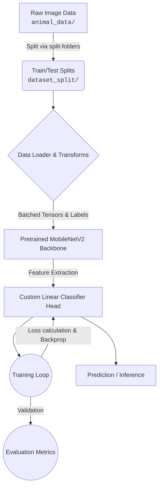

# 🐾 Deep Learning Animal Image Classifier

<div align="center">
  <p><strong>An end-to-end multi-class image classification pipeline powered by PyTorch and MobileNetV2.</strong></p>
</div>

## 📌 Project Overview
The **Animal Image Classifier** is a lightweight, efficient, and highly accurate computer vision system designed to categorize images of animals into their respective classes (e.g., Bear, Bird, Cat, Dog, Elephant, Zebra). 

Built to be a practical demonstration of **Transfer Learning**, this project leverages a pretrained convolutional neural network to achieve fast convergence with minimal training data. It takes raw image folders, processes them, trains a newly attached classification head, and evaluates the model's predictive power.

---

## 🏗️ End-to-End Architecture

This project follows a systematic ML engineering lifecycle, abstracting away unnecessary complexity while ensuring reproducibility. 



### 🧠 How It Works (The Core Mechanism)

1. **Data Ingestion & Formatting:** 
   The pipeline expects a clean directory structure where each folder represents a class label. Using standard `torchvision.datasets.ImageFolder`, it dynamically maps folders to PyTorch Tensors.
2. **Pre-processing:**
   Raw images are normalized and resized to align perfectly with the distribution that `MobileNetV2` was originally trained on (ImageNet). This ensures maximum feature extraction quality.
3. **Model Configuration:**
   We initialize the `MobileNetV2` backbone with pre-trained weights. By **freezing** the base layers, we prevent the destruction of foundational pattern recognition capabilities (like edge detection or texture recognition) that the model learned from millions of images.
4. **Transfer Learning & Optimizations:**
   A custom Dense/Linear layer acts as our new classifier head. We utilize the **AdamW** optimizer paired with **Cross-Entropy Loss** to calculate gradients and iteratively update the network's weights.
5. **Inference Function:**
   After training, isolated helper functions allow single `.jpg` or `.png` files to be passed directly through the network, outputting a Softmax probability curve and the top-1 class prediction.

---

## 🔬 Model & Technology Stack

### 🚀 Tech Stack
- **Framework:** PyTorch (`torch`, `torchvision`, `torchinfo`)
- **Data Engineering:** `split-folders`, `Pillow`
- **Visualization:** `matplotlib`
- **Environment:** Jupyter Notebook / Python 3.x

### 🧬 Why MobileNetV2?
- **Efficiency:** Utilizes depthwise separable convolutions to drastically reduce the number of parameters.
- **Speed:** Extremely lightweight, meaning inference can be run entirely on standard CPUs in milliseconds.
- **Accuracy:** Due to ImageNet pre-training, it recognizes real-world animal textures out-of-the-box.

---

## 📂 Repository Structure

```text
.
├── Animal-Classifier.ipynb       # Core training & inference pipeline
├── animal_data/                  # (User-provided) Raw image folders per class
├── dataset_split/                # (Auto-generated) Train & test distributions
├── kangaroo.jpg                  # Example prediction image
├── dolphin3.jpg                  # Example prediction image
└── README.md                     # Project documentation
```

> [!NOTE]
> *Note on folder naming:* While this codebase currently resides in a `Facial_Emotion_Recognition` folder on the host machine, the actual logic, modeling, and output presented here are fully dedicated to multi-class **Animal Image Classification**.

---

## ⚙️ Setup & Installation

Follow these steps to replicate the environment and begin training on your local system:

### 1. Environment Configuration (Linux / macOS)
```bash
# Initialize a virtual environment
python3 -m venv .venv
source .venv/bin/activate

# Upgrade pip
pip install --upgrade pip

# Install required dependencies
pip install torch torchvision torchinfo split-folders pillow matplotlib jupyter ipykernel
```
> [!TIP]
> **GPU Acceleration:** If you have an NVIDIA GPU, ensure you install the CUDA-compatible binaries from the [Official PyTorch Website](https://pytorch.org/get-started/locally/).

### 2. Preparing the Data
1. Create an `animal_data/` folder in the root directory.
2. Inside `animal_data/`, create subfolders for each animal you want to classify (e.g., `animal_data/Bear/`, `animal_data/Zebra/`).
3. Place your raw `.jpg` or `.png` images into their respective folders.

### 3. Execution
Launch Jupyter Notebook and open `Animal-Classifier.ipynb`. Run the cells sequentially to build the dataset splits, instantiate the dataloaders, execute the training epochs, and run single-image inferences. 

---

## 📈 Monitoring Performance & Results

During execution, keep an eye on the following outputs generated by the notebook:
- **Loss Curves (Train vs Test):** Watch for convergence and ensure the model isn't overfitting.
- **Accuracy Thresholds:** Expect an upward trajectory culminating in robust classification metrics.
- **Single-Image Robustness:** Take images completely outside of your dataset (from the internet) and pass them to the inference function to qualitatively test model generalization. 

---

## 💡 Future Enhancements
- [ ] **Data Augmentation Strategies:** Implement dynamic rotation, flipping, and color jitter to further generalize the model.
- [ ] **Experiment Tracking:** Integrate tools like Weights & Biases (WandB) or Tensorboard.
- [ ] **Deployment Preparation:** Export the final PyTorch weights to ONNX format to serve the model via an API (FastAPI) or run it natively on Edge devices.
